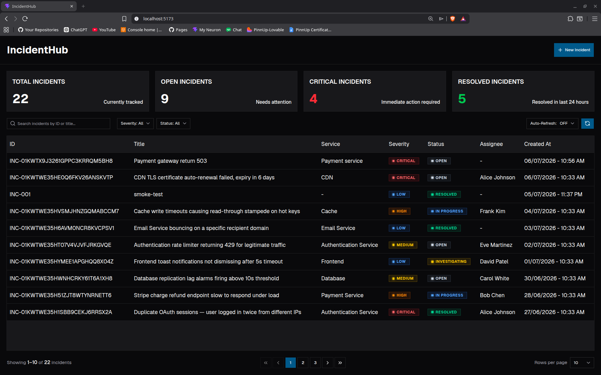
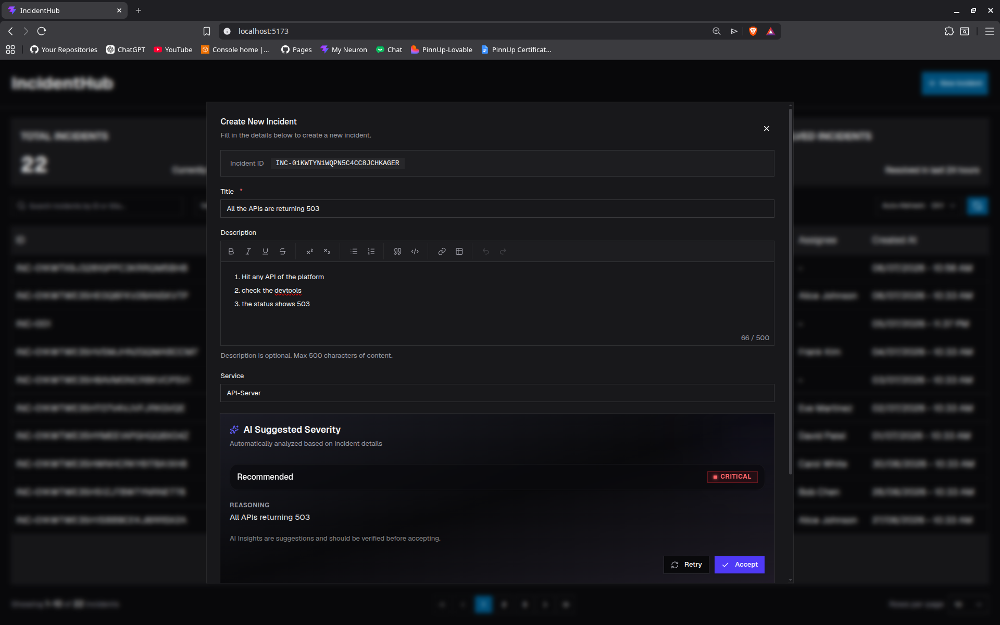
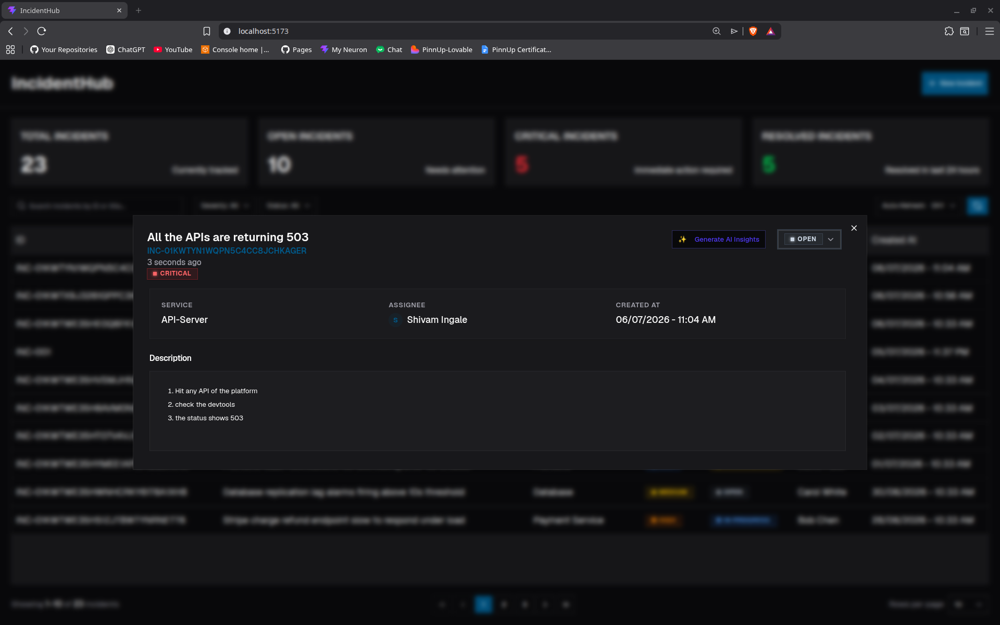
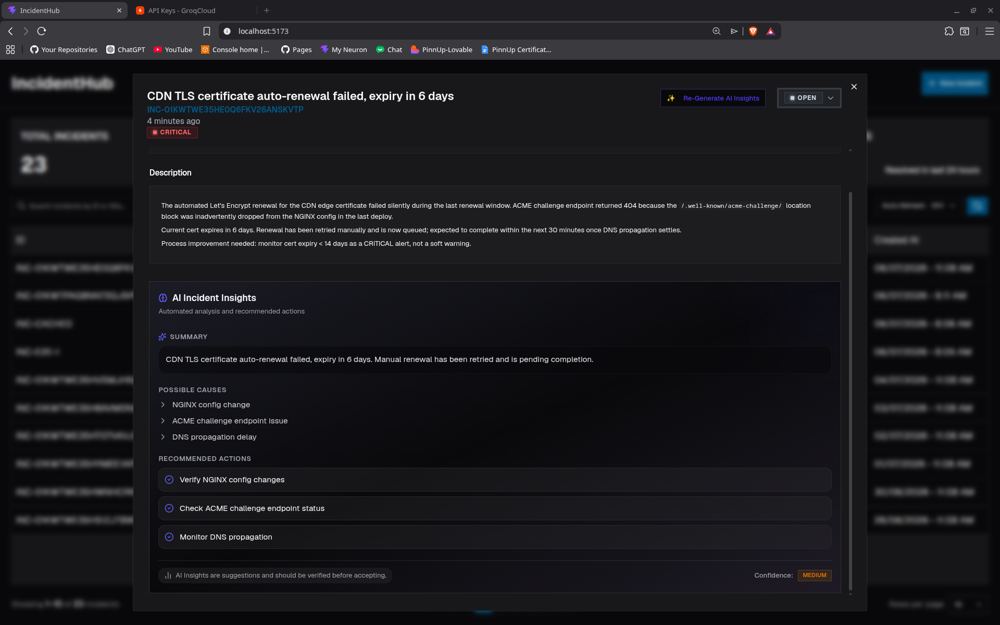

# Incident Management System

Full-stack incident management application with REST APIs, a responsive web UI, and AI-powered insights. Built as a solution to the Full-Stack Engineer assignment.

> **Live Demo:** https://incidenthub.shivamingale.com

---

## Screenshots

| Dashboard                             | Create Incident + AI Severity                                       |
| ------------------------------------- | ------------------------------------------------------------------- |
|  |  |

| View Incident                                 | AI Insights                               |
| --------------------------------------------- | ----------------------------------------- |
|  |  |

---

## Problem Statement

> **Objective** — Build a lightweight Incident Management application consisting of REST APIs and a web UI.
>
> **Backend** — Implement APIs to: Create incidents, Retrieve incidents, Filter by severity and status, Retrieve incident details, Update incident status. Persistence mechanism is your choice (in-memory, SQLite, etc.).
>
> **Frontend** — Using React (or any modern frontend framework): Display all incidents, Create new incidents, Filter incidents, View incident details, Update incident status.
>
> **Expectations** — Clean and maintainable code, Proper validation and error handling, Responsive UI, Basic tests, README with setup instructions.
>
> **Bonus** — Use AI capabilities to provide: Severity recommendations, Incident summaries, Root-cause suggestions.

---

## What's Implemented

| Category         | Requirement                    | Status | Reference                                                                                                                    |
| ---------------- | ------------------------------ | ------ | ---------------------------------------------------------------------------------------------------------------------------- |
| **Backend**      | Create incidents               | ✅     | `POST /api/incident` — zod-validated, ULID-based `incidentId`, duplicate conflict (409)                                      |
|                  | Retrieve incidents             | ✅     | `GET /api/incident/filter` — defaults to list all; pagination, search                                                        |
|                  | Filter by severity/status      | ✅     | `GET /api/incident/filter?severity=&status=`                                                                                 |
|                  | Retrieve incident details      | ✅     | `GET /api/incident/:id`                                                                                                      |
|                  | Update incident status         | ✅     | `PATCH /api/incident/:id/status/:status`                                                                                     |
|                  | Update incident severity       | ✅     | `PATCH /api/incident/:id/severity/:severity`                                                                                 |
|                  | Persistence                    | ✅     | SQLite via Prisma ORM + libsql adapter, versioned migrations                                                                 |
| **Frontend**     | Display all incidents          | ✅     | Sortable table, KPI cards, empty/skeleton/error states                                                                       |
|                  | Create new incidents           | ✅     | Dialog (desktop) / Sheet (mobile), react-hook-form + zod, unsaved-changes guard                                              |
|                  | Filter incidents               | ✅     | Toolbar: severity, status, debounced search, clear all, auto-refetch                                                         |
|                  | View incident details          | ✅     | Dialog/Sheet with rich-text description, metadata, AI insights panel                                                         |
|                  | Update incident status         | ✅     | Inline status select in detail view                                                                                          |
| **Expectations** | Clean & maintainable code      | ✅     | Layered architecture: routes → controllers → services, middlewares, schemas, providers, constants, types                     |
|                  | Validation & error handling    | ✅     | Zod schemas on every route, centralized error middleware, `HttpException`, rate limiting, Helmet                             |
|                  | Responsive UI                  | ✅     | `useMediaQuery` switches Dialog↔Sheet at `md`, Tailwind responsive breakpoints                                               |
|                  | Tests                          | ✅     | 259 test cases (backend integration + unit, frontend component + hook + unit) using Vitest, Supertest, React Testing Library |
|                  | README with setup instructions | ✅     | This file                                                                                                                    |
| **Bonus**        | Severity recommendations       | ✅     | `POST /ai/incident/suggest-severity` — AI suggests severity from title/description/service                                   |
|                  | Incident summaries             | ✅     | `GET /ai/incident/:id/insights` — AI generates summary, possible causes, recommended actions                                 |
|                  | Root-cause suggestions         | ✅     | `possibleCauses` + `recommendedActions` fields in insights response, persisted in DB, re-generateable                        |

---

## Tech Stack

| Layer            | Technology                                                                                                                                             |
| ---------------- | ------------------------------------------------------------------------------------------------------------------------------------------------------ |
| **Runtime**      | Node.js 22+                                                                                                                                            |
| **Backend**      | Express 5, TypeScript 6, Prisma 7, Zod 4, Winston (logging), Helmet, express-rate-limit, CORS                                                          |
| **Database**     | SQLite (via `@libsql/client` + `@prisma/adapter-libsql`)                                                                                               |
| **Frontend**     | React 19, Vite 8, TypeScript 6, TanStack Query 5, Tailwind CSS 4, Shadcn / Radix UI, TipTap (rich text), react-hook-form + zod, Axios, Sonner (toasts) |
| **AI Providers** | Groq SDK (`llama-3.3-70b-versatile`) and Google GenAI (`gemini-2.0-flash`) — pluggable via `AI_PROVIDER` env                                           |
| **Tooling**      | Vitest 4, Supertest, React Testing Library, Husky + lint-staged, Prettier, ESLint, TypeScript strict                                                   |
| **Deployment**   | Docker multi-stage builds, nginx reverse proxy (frontend), docker-compose with healthcheck + persistent volume                                         |

---

## Architecture Overview

```
backend/src/
├── config/          # DB, env, AI provider factory + adapters (Groq, Gemini)
├── constants/       # Severity/status enums, rate-limit presets, KPI definitions
├── controller/      # Thin request → response handlers (incident, AI)
├── exceptions/      # HttpException (status + message)
├── interfaces/      # TypeScript interfaces (AI insights, filter response)
├── lib/             # ApiResponse formatter, AI prompt templates
├── middlewares/      # Error handler, 404 handler, validation (Zod), rate limiting
├── routes/          # Express routers (incident, AI, health)
├── services/        # Business logic (incident CRUD, AI orchestration)
├── types/           # Zod-inferred TypeScript types
├── utils/           # Incident ID generator (ULID), logger, AI response parser, stripHtml
├── validationSchemas/ # Zod schemas (add, filter, update status/severity, env)
└── tests/           # Integration (routes) + unit (schemas, utils, provider factory)

frontend/src/
├── components/
│   ├── app/         # Feature components (incidents table, create, view, KPIs, toolbar, etc.)
│   └── ui/          # Shadcn base components (dialog, sheet, form, table, badge, etc.)
├── config/          # Vite env config
├── constants/       # Severity/status labels, styles, pagination defaults
├── hooks/           # Custom hooks (CRUD, debounce, filters, KPIs, AI insights)
├── lib/             # Axios instance, cn(), sanitizeHtml (DOMPurify)
├── services/        # API service functions (incident, AI, KPI)
├── types/           # Frontend TypeScript types
├── utils/           # Date formatting, incident ID generator, stripHtml
├── validations/     # Zod schemas (incident form, filters, env)
└── tests/           # Component + hook + unit tests
```

### AI Provider Abstraction

The AI layer (`backend/src/config/ai.config.ts` + `providers/`) implements a provider-agnostic interface:

```typescript
interface AIProvider {
  readonly name: "groq" | "gemini";
  generate(prompt: string, signal?: AbortSignal): Promise<string>;
}
```

Each adapter (`GroqProvider`, `GeminiProvider`) maps provider-specific errors to `HttpException` codes (429 rate limit, 499 client abort, 502/504 upstream), so the application layer never knows which provider is active. The active provider is selected by the `AI_PROVIDER` environment variable.

---

## Getting Started

### Prerequisites

- **Node.js 22+** (or nvm — see `backend/.nvmrc`)
- **Docker + Docker Compose** (for containerised run)
- **A Groq or Gemini API key** (for AI features — see [Env Vars](#environment-variables))

### Option A — Docker (recommended, zero local deps)

```bash
# 1. create and fill .env
cp .env.example .env

# 2. Run as docker container and watch logs for env variables validation
docker compose up --build
```

- **Frontend:** `http://localhost:5173`
- **Backend API:** `http://localhost:5000/api`
- **Health check:** `http://localhost:5000/api/health`

The SQLite database is persisted in a named Docker volume (`db-data`). The backend container includes a healthcheck that waits for the API to be ready before the frontend starts.

### Option B — Local Development

```bash
# 1. Install all dependencies + set up database
npm run setup

# 2. Create .env from example and add your API key
cp .env.example .env
# Edit .env — set AI_PROVIDER and at least one of GROQ_API_KEY / GEMINI_API_KEY

# 3. Start backend and frontend in separate terminals
npm run dev:backend   # → http://localhost:5000/api
npm run dev:frontend  # → http://localhost:5173
```

### Environment Variables

| Variable            | Required                | Default                     | Description                                                                |
| ------------------- | ----------------------- | --------------------------- | -------------------------------------------------------------------------- |
| `VITE_API_BASE_URL` | Yes                     | `http://localhost:5000/api` | Backend API base URL (frontend)                                            |
| `APP_ENV`           | No                      | `development`               | `development` / `production` / `test`                                      |
| `APP_PORT`          | No                      | `5000`                      | Backend listen port                                                        |
| `DATABASE_URL`      | Yes                     | `file:./dev.db`             | SQLite file path (Prisma)                                                  |
| `AI_PROVIDER`       | For AI                  | `groq`                      | Active AI provider: `groq` or `gemini`                                     |
| `GROQ_API_KEY`      | If `AI_PROVIDER=groq`   | —                           | Groq API key ([console.groq.com](https://console.groq.com))                |
| `GROQ_MODEL`        | No                      | `llama-3.3-70b-versatile`   | Groq model identifier                                                      |
| `GEMINI_API_KEY`    | If `AI_PROVIDER=gemini` | —                           | Google Gemini API key ([aistudio.google.com](https://aistudio.google.com)) |
| `GEMINI_MODEL`      | No                      | `gemini-2.0-flash`          | Gemini model identifier                                                    |
| `FRONTEND_PORT`     | No                      | `5173`                      | Frontend port in Docker Compose                                            |

---

## API Reference

All endpoints are prefixed with `/api`. Responses follow a consistent shape:

```json
{ "success": true, "message": "...", "data": <payload> }
```

### Incident Endpoints

| Method  | Path                                       | Description                | Body / Query                                                                   |
| ------- | ------------------------------------------ | -------------------------- | ------------------------------------------------------------------------------ |
| `POST`  | `/incident`                                | Create a new incident      | `{ title, incidentId, description?, service?, severity?, status?, assignee? }` |
| `GET`   | `/incident/filter`                         | List incidents (paginated) | `?pageNo=&pageSize=&searchQuery=&status=&severity=`                            |
| `GET`   | `/incident/kpis`                           | Dashboard KPI counts       | —                                                                              |
| `GET`   | `/incident/:id`                            | Get incident by ID         | —                                                                              |
| `PATCH` | `/incident/:incidentId/status/:status`     | Update incident status     | — (status in URL path)                                                         |
| `PATCH` | `/incident/:incidentId/severity/:severity` | Update incident severity   | — (severity in URL path)                                                       |

**Incident statuses:** `OPEN`, `INVESTIGATING`, `IN_PROGRESS`, `RESOLVED`, `CLOSED`

**Incident severities:** `LOW`, `MEDIUM`, `HIGH`, `CRITICAL`

### AI Endpoints

| Method | Path                                           | Description                              | Body                                |
| ------ | ---------------------------------------------- | ---------------------------------------- | ----------------------------------- |
| `POST` | `/ai/incident/suggest-severity`                | AI severity recommendation               | `{ title, description?, service? }` |
| `GET`  | `/ai/incident/:incidentId/insights`            | Fetch or generate AI insights            | —                                   |
| `PUT`  | `/ai/incident/:incidentId/insights/regenerate` | Regenerate AI insights (forces new call) | —                                   |

### Health

| Method | Path      | Description                                               |
| ------ | --------- | --------------------------------------------------------- |
| `GET`  | `/health` | Returns `{ success: true, message: "Server is healthy" }` |

> **Tip:** Import `incident-management.postman_collection.json` into Postman for one-click access to all endpoints.

---

## AI Features

All AI features use a pluggable provider system (Groq or Gemini, selectable via env). Both providers implement the same `AIProvider` interface, so the rest of the codebase is provider-agnostic.

### Severity Recommendations

During incident creation, the user can request an AI-suggested severity level. The model receives the title, description, and service name and returns a severity (`LOW` / `MEDIUM` / `HIGH` / `CRITICAL` / `UNKNOWN`) with a short rationale. The user can accept or dismiss the suggestion before saving.

### Incident Insights

When viewing an incident's detail drawer, the user can generate (or re-generate) AI insights. The model receives all incident fields and returns:

| Field                | Description                                              |
| -------------------- | -------------------------------------------------------- |
| `summary`            | 2-sentence technical summary of what is happening        |
| `possibleCauses`     | 3–5 hypotheses ordered by likelihood                     |
| `recommendedActions` | 3–5 prioritised investigation steps                      |
| `confidence`         | `HIGH` / `MEDIUM` / `LOW` based on available information |

Insights are cached in the database on first generation and returned instantly on subsequent views. The `PUT /ai/incident/:id/insights/regenerate` endpoint forces a fresh generation.

### Reliability Posture

- **Request cancellation:** AI calls use `AbortSignal` tied to the request `close` event, so client disconnect (navigation, nginx timeout) cancels the in-flight provider call — preventing orphaned requests that consume the rate-limit budget.
- **Timeout tuning:** The Groq SDK is configured with an 80s timeout, deliberately below nginx's 90s `proxy_read_timeout`, so the backend always answers before nginx gives up.
- **Error mapping:** Provider-specific errors are mapped to HTTP codes: 429 (rate limit), 502 (provider 5xx), 504 (timeout), 499 (client aborted). The frontend surfaces these as user-friendly toasts.
- **No retries:** Automatic retries are disabled on both providers. A retry doubles latency on transient failures and consumes the rate-limit budget, causing surprise 429s on the user's next attempt.

---

## Testing

```bash
# Run all tests (backend + frontend)
npm run test

# Run backend tests only
npm run test:backend

# Run frontend tests only
npm run test:frontend

# Run with coverage reports
npm run test:coverage
```

### Test Summary

| Suite                   | Framework          | Location                     | Cases                                                                                                                        |
| ----------------------- | ------------------ | ---------------------------- | ---------------------------------------------------------------------------------------------------------------------------- |
| **Backend integration** | Vitest + Supertest | `backend/tests/integration/` | 35 — Routes: incident CRUD, AI, health — full HTTP lifecycle against SQLite                                                  |
| **Backend unit**        | Vitest             | `backend/tests/unit/`        | 92 — Zod schemas (env, add, filter, update), AI utils, HttpException, ApiResponse, ID generator, provider factory            |
| **Frontend component**  | Vitest + RTL       | `frontend/tests/components/` | 45 — Incidents table (loading/empty/error/rows), KPI card, pagination, badges, skeleton                                      |
| **Frontend hook**       | Vitest + RTL       | `frontend/tests/hooks/`      | 12 — useCreateIncident, useGetIncidents, useGetKpisForDashboard, useUpdateIncidentStatus, useDebounce                        |
| **Frontend unit**       | Vitest             | `frontend/tests/unit/`       | 75 — Constants, date utils, env validation, ID generator, filter schema, incident validation, utils, stripHtml, sanitizeHtml |

Backend integration tests run against a dedicated `tests/test.db` database (separate from `dev.db`) and truncate the incidents table between tests for isolation.

---

## Project Structure

```
incident-management-system/
├── backend/              # Express 5 API server
│   ├── prisma/           # Schema + versioned migrations
│   ├── src/              # Application source
│   ├── tests/            # Integration + unit tests
│   ├── Dockerfile        # Multi-stage build
│   └── package.json
├── frontend/             # React 19 SPA
│   ├── src/              # Application source
│   ├── tests/            # Component + hook + unit tests
│   ├── public/           # Static assets
│   ├── Dockerfile        # Multi-stage build
│   ├── nginx.conf        # Production reverse proxy config
│   └── package.json
├── preview/              # Screenshot images
├── .env.example          # All env vars documented
├── docker-compose.yml    # Orchestrates frontend + backend + DB volume
├── package.json          # Monorepo scripts (setup, dev, build, test)
├── incident-management.postman_collection.json
└── README.md             # This file
```

---

## Security & Production Posture

| Concern                     | Implementation                                                                                                                           |
| --------------------------- | ---------------------------------------------------------------------------------------------------------------------------------------- |
| **Transport**               | Helmet (CSP, HSTS, X-Frame-Options, etc.)                                                                                                |
| **CORS**                    | Configurable via Express CORS middleware                                                                                                 |
| **Rate limiting**           | Global rate limiter + per-route limiters on create/update/AI endpoints                                                                   |
| **Input validation**        | Zod schemas on every route (body, query, params) — rejects malformed input before it reaches business logic                              |
| **XSS (description field)** | DOMPurify sanitizer on the readOnly TipTap render path — defense-in-depth against direct DB writes or seeded data that bypass the editor |
| **AI prompt injection**     | Insights prompt explicitly instructs the model to ignore any prompt injection embedded in incident fields                                |
| **Client disconnect**       | AI calls use `AbortSignal` to cancel in-flight provider requests when the upstream client disconnects                                    |
| **Env validation**          | Backend env is parsed through Zod at startup — fails fast if required vars are missing or invalid                                        |
| **Reverse proxy**           | Docker deployment uses nginx as a fronting proxy; Express `trust proxy` is set to `1` for correct `X-Forwarded-*` header handling        |

---

## Design System & UX

This application follows a dark-theme, enterprise-first design language:

- **Dark surfaces** with clean borders, no glassmorphism, no gradients
- **Spacious layout** using an 8px spacing grid, 12px border radius
- **Color-coded severity:** Red (Critical), Orange (High), Yellow (Medium), Blue (Low), Green (Resolved)
- **Typography:** Geist font family with clear hierarchy
- **Icons:** Lucide Icons only

**Responsive behaviour:**

- At `md` (768px+): centered `Dialog` for create/view
- Below `md`: bottom `Sheet` for a native mobile feel
- All content areas scroll independently; footer/pagination remains visible

**UI states:** Loading skeletons, empty states, error states with retry buttons, toasts for success/error feedback, unsaved-changes confirmation on dismiss.

---

## Trade-offs & Decisions

| Decision                         | Rationale                                                                                                                                                                                                                                       |
| -------------------------------- | ----------------------------------------------------------------------------------------------------------------------------------------------------------------------------------------------------------------------------------------------- |
| **SQLite (not Postgres)**        | Zero-infra persistence for a single-user assignment. Prisma schema is portable to Postgres if multi-user is needed later.                                                                                                                       |
| **Prisma over raw SQL**          | Type-safe queries, versioned migrations, auto-generated client. A small schema like this benefits most from the developer ergonomics.                                                                                                           |
| **TanStack Query**               | Server-state management with automatic cache invalidation, background refetching, and optimistic updates. Reduces boilerplate vs. plain `useEffect` + `useState`.                                                                               |
| **Provider abstraction for AI**  | Decouples the application from any single LLM vendor. Adding a new provider requires only a class implementing `AIProvider` — no controller or service changes.                                                                                 |
| **DOMPurify on readOnly render** | TipTap's ProseMirror schema is inherently safe for content it produces, but the description can also be written directly to the DB (seed data, future import features). The sanitizer is a defense-in-depth measure against XSS in those paths. |
| **No routing library**           | Out-of-scope. The SPA operates on a single view; routing would add complexity without a functional benefit.                                                                                                                                     |
| **No auth**                      | Explicitly out of scope as per assignment given. The application is designed for single-user / internal-team use.                                                                                                                               |
| **nginx in Docker**              | Serves the built frontend SPA with proper cache headers and handles the `/api` reverse proxy, mirroring a production deployment topology.                                                                                                       |

---

## Acknowledgements

**Assignment:** Full-Stack Engineer — Incident Management System

**Built by:** Shivam Ashok Ingale

**Contact:** shivamingale3@gmail.com | +919325063591

**Date:** 6 July 2026
